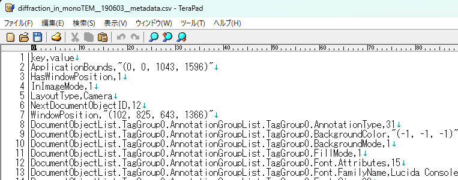
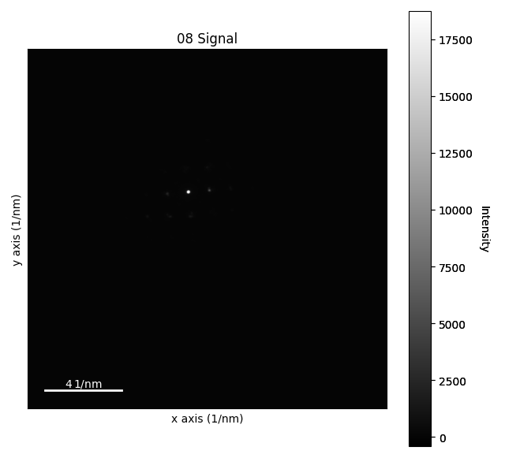
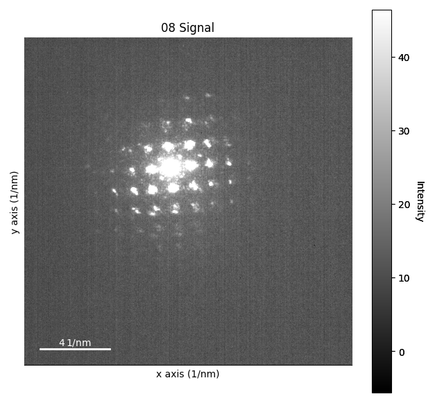
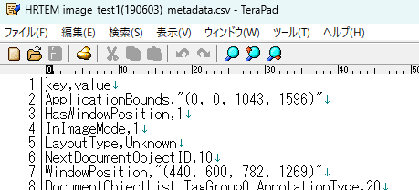
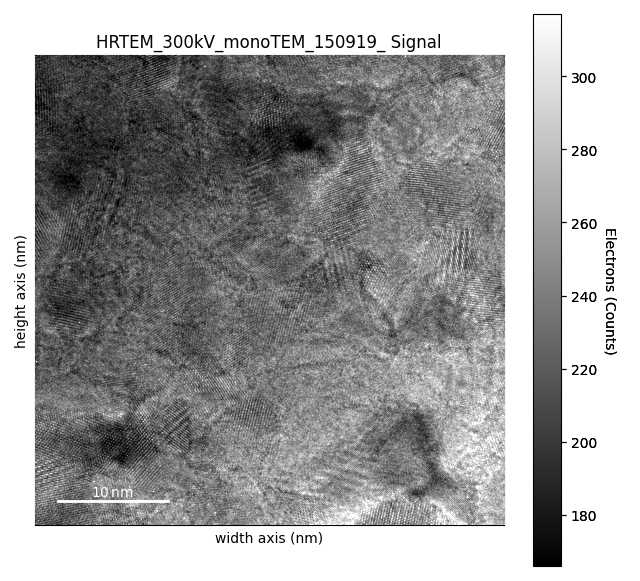
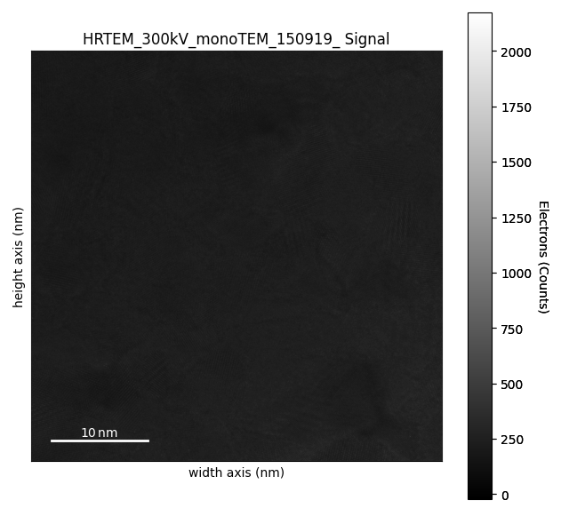
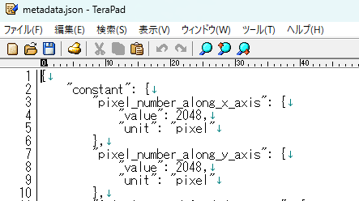
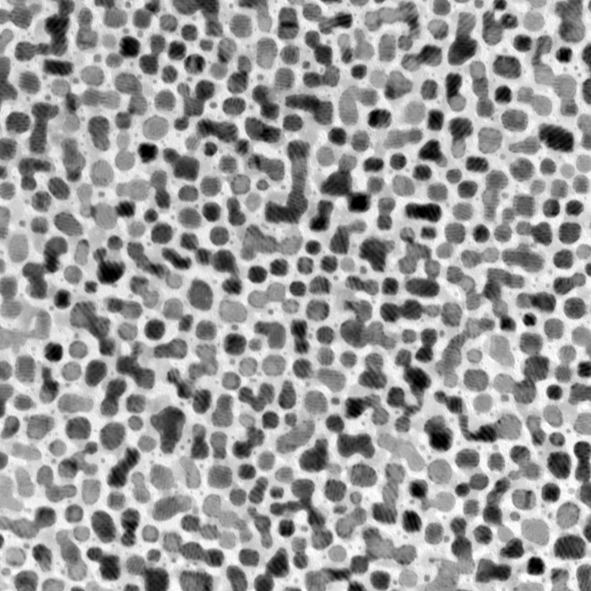
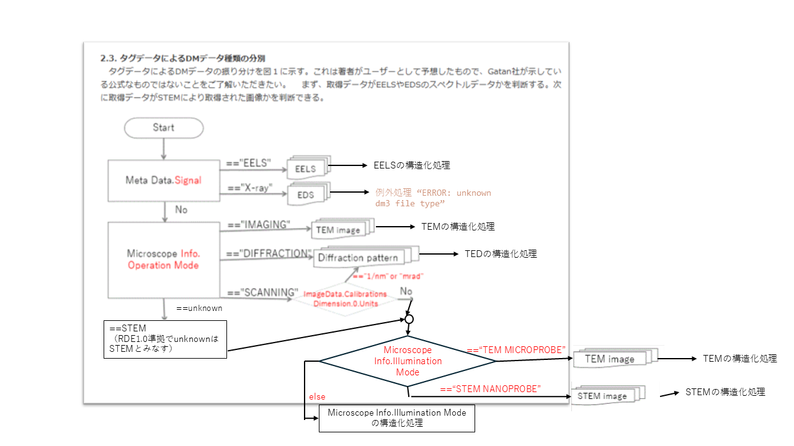

# 透過電子顕微鏡データ標準テンプレート

## 概要

透過電子顕微鏡データを登録したい方に適したテンプレートです。２つの入力モードがあり、１つはGatan社 Digital Micrographのdm3フォーマットから計測手法を自動的に判別して、適切な可視化・可読化を行うTEM_DM3モードで、対応する計測手法は、TEM、STEM、TED、EELSです。もう１つは、dm3、tiff、png、bmpなどの画像ファイルを入力し、必要に応じて可視化・可読化を行うEMモードです。なお、すべての入力ファイルの解析にHyperSpyを用います。

## カタログ番号

本テンプレートには、入力モードの違いによって以下のバリエーションが提供されています。
- DT0008
    - TEM_DM3モード
- DT0010
    - EMモード

## 対象とする装置と計測手法

- TEM_DM3モード:
  - 計測手法:
    - 透過電子顕微鏡法（TEM）
    - 走査透過電子顕微鏡法（STEM）
    - 透過電子回折法（TED）
    - 電子エネルギー損失分光法（EELS）
  - 対象装置: 透過型電子顕微鏡（TEM）
- EMモード:
  - 計測手法: なし
  - 対象装置: なし

## データタイルの構成要素

本データセットテンプレートで作成したデータセットには、`データファイル`と`構造化ファイル`と`メタ情報`を登録することができます。なお、データファイルは１つ登録する必要があります。

### 入力ファイル

#### TEM_DM3モード

||内容|必須|本ドキュメントでの仮名|
|:----|:----|:----|:----|
|1|Gatan社 Digital Micrographが出力するdm3形式のTEM測定データファイル|1ファイルのみ|入力ファイル名|

#### EMモード

||内容|必須|本ドキュメントでの仮名|
|:----|:----|:----|:----|
|1|Gatan社 Digital Micrographが出力するdm3形式のファイル|1~3いずれか1ファイル|入力ファイル名|
|2|Tiff形式のファイル（拡張子: .tif, .tiff）|1~3いずれか1ファイル|入力ファイル名|
|3|画像ファイル（拡張子: .bmp, .png, .jpg, .gif）|1~3いずれか1ファイル|入力ファイル名|

#### 入力ファイルの仕様

- いずれのファイルも命名規則はありません。

### 出力ファイル

#### TEM_DM3モード

| ファイル名 | 内容 |備考|
|:----|:----|:----|
|<入力ファイル名>.tif|測定データ画像ファイル（測定手法がeels以外の場合）||
|<入力ファイル名>.png|測定データ画像のRDE表示用ファイル（測定手法がeels以外の場合）||
|<入力ファイル名>_conv.png|コントラスト調整後の測定データ画像ファイル（測定手法がeels以外の場合）||
|<入力ファイル名>.png|測定データ折れ線グラフプロット画像ファイル（測定手法がeelsの場合）||
|<入力ファイル名>_metadata.csv|入力ファイルから抽出したメタデータ||
|metadata.json|主要パラメータメタ情報ファイル||

#### EMモード:
  - Gatan社 Digital Micrographが出力するdm3形式のファイル:

| ファイル名 | 内容 |備考|
|:----|:----|:----|
|<入力ファイル名>.tif|測定データ画像ファイル（測定データが画像データの場合）||
|<入力ファイル名>.png|測定データ画像のRDE表示用ファイル（測定データが画像データの場合）||
|<入力ファイル名>_conv.png|コントラスト調整後の測定データ画像ファイル（測定データが画像データの場合）||
|<入力ファイル名>.png|測定データ折れ線グラフプロット画像ファイル（測定データがスペクトラムの場合）||
|<入力ファイル名>_metadata.csv|入力ファイルから抽出したメタデータ||
|metadata.json|主要パラメータメタ情報ファイル||

  - Tiff形式のファイル:

| ファイル名 | 内容 |備考|
|:----|:----|:----|
|<入力ファイル名>_conv.png|コントラスト調整後の画像ファイル||
|<入力ファイル名>.png|入力ファイルをpng化したファイル||
|<入力ファイル名>_metadata.csv|Exifデータ（Exifをできない場合は空）||
|metadata.json|主要パラメータメタ情報ファイル||

  - 画像ファイル:

| ファイル名 | 内容 |備考|
|:----|:----|:----|
|<入力ファイル名>.png|入力ファイルをpng化したファイル||
|<入力ファイル名>_metadata.csv|Exifデータ（Exifをできない場合は空）||
|metadata.json|主要パラメータメタ情報ファイル||

### メタ

#### 送り状メタ（インボイス項目、手入力メタ）

次のように、大きく４つに分類されます。

- 基本情報
- 固有情報
- 試料情報
- 抽出メタ情報

##### 基本情報

基本情報はすべてのデータセットテンプレート共通のメタです。詳細は[データセット閲覧 RDE Dataset Viewer > マニュアル](https://dice.nims.go.jp/services/RDE/RDE_manual.pdf)を参照してください。

##### 固有情報

固有情報はデータセットテンプレート特有のメタです。以下は本データセットテンプレートに設定されている固有メタ情報項目です。

###### TEM_DM3モード

|項目名|必須|日本語語彙|英語語彙|type|単位|初期値|備考|
|:----|:----|:----|:----|:----|:----|:----|:----|
sputtering_apparatus||スパッタリング装置|Sputtering Apparatus|string||||
|specimen_label||試料名|Specimen label|string||||
|sample.year||試料作製年|Sample year|number||||
|sample.month||試料作製月|Sample month|number||||
|stem_stem_imaging_mode||STEM像の種類(BR/ABF/ADF/HAADF/..)|STEM imaging mode|string||||
|stem_convergence_semiangle||収束半角|Convergence semiangle|number|mrad|||
|stem_inner_detection_semiangle||取り込み半角（内側）|Inner detection semiangle|number|mrad|||
|stem_outer_detection_semiangle||取り込み半角（外側）|Outer detection semiangle|number|mrad|||
|stem_gun_type||電子銃|Gun type|string||||
|stem_probe_current||プローブ電流|Probe current|string|pA|||
|stem_number_of_integrated_frames||積算枚数|Number of integrated frames|number||||
|tem_tem_imaging_mode||TEM像の種類(BF/DF/..)|TEM imaging mode(BF/DF/..)|string||||
|tem_illumination_semiangle||照射半角|Illumination semiangle|number|mrad|||
|tem_objective_aperture_radius||対物絞り径（半角）|Objective aperture radius|number|mrad|||
|tem_gun_type||電子銃|Gun type|string||||
|tem_probe_current||プローブ電流|Probe current|string|pA|||
|tem_number_of_integrated_frames||積算枚数|Number of integrated frames|number||||
|eels_convergence_semiangle||収束半角|Convergence semiangle|number|mrad|||
|eels_collection_semiangle||取り込み半角|Collection semiangle|number|mrad|||
|eels_gun_type||電子銃|Gun type|string||||
|eels_energy_resolution_fwhm||エネルギー分解能（FWHM)|Energy resolution(FWHM)|number|eV|||
|eels_relative_thickness||相対膜厚|Relative thickness|number||||
|eels_element_and_edge||元素と励起内殻|Element and edge|string||||
|eels_energy_calibration||エネルギーキャリブレーション|Energy calibration|string||||
|common_data_type||登録データタイプ|Data type|string||TEM||
|common_data_origin||データの起源|Data Origin|string||experiment||
|common_technical_category||技術カテゴリー|Technical Category|string||measurement||
|common_reference||参考文献|Reference|string||||
|measurement_method_category||計測法カテゴリー|Method category|string||顕微法|装置情報から自動取得|
|measurement_method_sub-category||計測法サブカテゴリー|Method sub-category|string||透過電子顕微鏡法|装置情報から自動取得|
|measurement_analysis_field||分析分野|Analysis field|string||||
|measurement_measurement_environment||測定環境|Measurement environment|string||||
|measurement_energy_level_transition_structure_etc._of_interest||対象準位_遷移_構造|Energy Level_Transition_Structure etc. of interest|string||||
|measurement_measured_date||分析年月日|Measured date|string[date]|||入力ファイルから自動取得|
|measurement_standardized_procedure||標準手順|Standardized procedure|string||||
|measurement_instrumentation_site||装置設置場所|Instrumentation site|string||千現地区||

###### EMモード

|項目名|必須|日本語語彙|英語語彙|単位|初期値|データ型|フォーマット|備考|
|:----|:----|:----|:----|:----|:----|:----|:----|:----|
|key1||キー1|key1|||string||汎用項目|
|key2||キー2|key2|||string||汎用項目|
|key3||キー3|key3|||string||汎用項目|
|key4||キー4|key4|||string||汎用項目|
|key5||キー5|key5|||string||汎用項目|
|key6||キー6|key6|||string||汎用項目|
|key7||キー7|key7|||string||汎用項目|
|key8||キー8|key8|||string||汎用項目|
|key9||キー9|key9|||string||汎用項目|
|key10||キー10|key10|||string||汎用項目|

##### 試料情報

###### モード共通:

|項目名|必須|日本語語彙|英語語彙|単位|初期値|データ型|フォーマット|備考|
|:----|:----|:----|:----|:----|:----|:----|:----|:----|
|sample_name_(local_id)|〇|試料名(ローカルID)|Sample name (Local ID)||例）入力ファイル名のセクション2をマッピング|string|||
|chemical_formula_etc.||化学式・組成式・分子式など|Chemical formula etc.|||string|||
|administrator_(affiliation)|〇|試料管理者(所属)|Administrator (Affiliation)|||string|||
|reference_url||参考URL|Reference URL|||string|||
|related_samples||関連試料|Related samples|||string|||
|tags||タグ|Tags|||string|||
|description||試料の説明|Description |||string|||
|sample.general.general_name||一般名称|General name|||string|||
|sample.general.cas_number||CAS番号|CAS Number|||string|||
|sample.general.crystal_structure||結晶構造|Crystal structure|||string|||
|sample.general.sample_shape||試料形状|Sample shape|||string|||
|sample.general.purchase_date||試料購入日|Purchase date|||string|||
|sample.general.supplier||購入元|Supplier|||string|||
|sample.general.lot_number_or_product_number_etc||ロット番号、製造番号など|Lot number or product number etc|||string|||

#### 抽出メタ

抽出メタ情報は、データファイルから構造化処理で抽出したメタデータです。以下は本データセットテンプレートに設定されている抽出メタ情報項目です。

##### TEM_DM3モード（TEM）

|項目名|日本語語彙|英語語彙|単位|データ型|抽出元|備考|
|:----|:----|:----|:----|:----|:----|:----|
|measurement_technique|測定手法|Measurement Technique||string|dm3ファイルメタデータ|`TEM`固定|
|tem.operator_identifier|測定者|Operator identifier||string|ImageList.TagGroup0.ImageTags.Session Info.Operator||
|tem.operator_affiliation_identifier|測定者所属機関|Operator affiliation identifier||string|||
|tem.institution_idendfier|所属施設など|Institution idendfier||string|||
|tem.measurement_instrument|測定装置|Measurement Instrument||string|ImageList.TagGroup0.ImageTags.Session Info.Items.TagGroup2.Value||
|tem.experiment_id|測定内容識別ID|Experiment ID||string|||
|tem.file_property|測定ファイル_属性|File Property||string|||
|tem.operation_date_time_year|測定日時[年]|Operation Date-time[Year]||number|ImageList.TagGroup0.ImageTags.DataBar.Acquisition Date||
|tem.operation_date_time_month|測定日時[月]|Operation Date-time[Month]||number|ImageList.TagGroup0.ImageTags.DataBar.Acquisition Date||
|tem.operation_date_time_day|測定日時[日]|Operation Date-time[Day]||number|ImageList.TagGroup0.ImageTags.DataBar.Acquisition Date||
|tem.operation_date_time_hour|測定日時[時]|Operation Date-time[Hour]||number|ImageList.TagGroup0.ImageTags.DataBar.Acquisition Time||
|tem.operation_date_time_minute|測定日時[分]|Operation Date-time[Minute]||number|ImageList.TagGroup0.ImageTags.DataBar.Acquisition Time||
|tem.operation_date_time_second|測定日時[秒]|Operation Date-time[Second]||number|ImageList.TagGroup0.ImageTags.DataBar.Acquisition Time||
|tem.dwell_time|画素滞在時間|Dwell Time|us|number|ImageList.TagGroup0.ImageTags.DigiScan.Sample Time||
|tem.image_data_size|画像データサイズ|Image Data Size||number|ImageList.TagGroup0.ImageData.Data.size||
|tem.origin_of_tem_image_intensity|TEM像強度の原点|Origin of TEM image intensity||number|ImageList.TagGroup0.ImageData.Calibrations.Brightness.Origin||
|tem.scale_of_tem_image_intensity|TEM像強度のスケール|Scale of TEM image intensity||number|ImageList.TagGroup0.ImageData.Calibrations.Brightness.Scale||
|tem.unit_of_tem_image_intensity|TEM像強度の単位|Unit of TEM image intensity||string|ImageList.TagGroup0.ImageData.Calibrations.Brightness.Units||
|tem.pixel_size_along_x_axis|x方向の画素サイズ|Pixel size along x axis||number|ImageList.TagGroup0.ImageData.Calibrations.Dimension.TagGroup0.Scale||
|tem.pixel_size_along_y_axis|y方向の画素サイズ|Pixel size along y axis||number|ImageList.TagGroup0.ImageData.Calibrations.Dimension.TagGroup1.Scale||
|tem.pixel_number_along_x_axis|x方向の画素数|Pixel number along x axis|pixel|number|ImageList.TagGroup0.ImageData.Dimensions.Data0||
|tem.pixel_number_along_y_axis|y方向の画素数|Pixel number along y axis|pixel|number|ImageList.TagGroup0.ImageData.Dimensions.Data1||
|tem.pixel_actual_size_along_x_axis|x方向の実サイズ|Pixel actual size along x axis|nm|number||tem.pixel_number_along_x_axis * tem.pixel_size_along_x_axis|
|tem.pixel_actual_size_along_y_axis|y方向の実サイズ|Pixel actual size along y axis|nm|number||tem.pixel_number_along_y_axis * tem.pixel_size_along_y_axis|
|tem.dynamic_range_of_tem_image_intensity|TEM像強度のダイナミックレンジ|Dynamic range of TEM image intensity|byte|number|ImageList.TagGroup0.ImageData.PixelDepth||
|tem.name_of_scanning_unit|走査装置名称|Name of scanning unit||string|ImageList.TagGroup0.ImageTags.DataBar.Device Name||
|tem.serial_number_by_scanning_unit|走査ユニット出力シリアル番号|Serial number by scanning unit||number|ImageList.TagGroup0.ImageTags.DataBar.Exposure Number||
|tem.flyback_time|振り戻し時間|Flyback time||number|ImageList.TagGroup0.ImageTags.DigiScan.Flyback||
|tem.line_synchronization|電源同期|Line synchronization||string|ImageList.TagGroup0.ImageTags.DigiScan.Synchronize Lines||
|tem.gms_version_for_acquisition|データ取得GMSバージョン|GMS version for acquisition||string|ImageList.TagGroup0.ImageTags.GMS Version.Created||
|tem.gms_version_for_saving|データ保存GMSバーション|GMS version for saving||string|ImageList.TagGroup0.ImageTags.GMS Version.Saved||
|tem.magnification|倍率|Magnification||number|ImageList.TagGroup0.ImageTags.Microscope Info.Indicated Magnification||
|tem.acceleration_voltage|加速電圧|Acceleration voltage|V|number|ImageList.TagGroup0.ImageTags.Microscope Info.Voltage||
|tem.post_specimen_lens_setting|結像系レンズ設定|Post-specimen lens setting||string|ImageList.TagGroup0.ImageTags.Microscope Info.Imaging Mode||
|tem.pre_specimen_lens_setting|照射系レンズ設定|Pre-specimen lens setting||string|ImageList.TagGroup0.ImageTags.Microscope Info.Illumination Mode||
|tem.microscope_information|電子顕微鏡情報|Microscope information||string|ImageList.TagGroup0.ImageTags.Microscope Info.Name||
|tem.microscope_operation_mode|電子顕微鏡モード|Microscope operation mode||string|ImageList.TagGroup0.ImageTags.Microscope Info.Operation Mode||
|tem.stem_camera_length|STEMカメラ長|STEM camera length|mm|number|ImageList.TagGroup0.ImageTags.Microscope Info.STEM Camera Length||
|tem.file_name|ファイル名|File name||string|ImageList.TagGroup0.Name||
|tem.session_information_microscope|セッション情報（電子顕微鏡）|Session information(microscope)||string|ImageList.TagGroup0.ImageTags.Session Info.Microscope||
|tem.session_information_operator|セッション情報（オペレーター）|Session information(operator)||string|ImageList.TagGroup0.ImageTags.Session Info.Operator||
|tem.session_information_specimen|セッション情報（試料）|Session_information(specimen)||string|ImageList.TagGroup0.ImageTags.Session Info.Specimen||

##### TEM_DM3モード（STEM）

|項目名|日本語語彙|英語語彙|単位|データ型|抽出元|備考|
|:----|:----|:----|:----|:----|:----|:----|
|measurement_technique|測定手法|Measurement Technique||string|dm3ファイルメタデータ|`STEM`固定|
|stem.operator_identifier|測定者|Operator identifier||string|ImageList.TagGroup0.ImageTags.Session Info.Operator||
|stem.operator_affiliation_identifier|測定者所属機関|Operator affiliation identifier||string|||
|stem.institution_idendfier|所属施設など|Institution idendfier||string|||
|stem.measurement_instrument|測定装置|Measurement Instrument||string|ImageList.TagGroup0.ImageTags.Session Info.Items.TagGroup2.Value||
|stem.experiment_id|測定内容識別ID|Experiment ID||string|||
|stem.file_property|測定ファイル_属性|File Property||string|||
|stem.operation_date_time_year|測定日時[年]|Operation Date-time[Year]||number|ImageList.TagGroup0.ImageTags.DataBar.Acquisition Date||
|stem.operation_date_time_month|測定日時[月]|Operation Date-time[Month]||number|ImageList.TagGroup0.ImageTags.DataBar.Acquisition Date||
|stem.operation_date_time_day|測定日時[日]|Operation Date-time[Day]||number|ImageList.TagGroup0.ImageTags.DataBar.Acquisition Date||
|stem.operation_date_time_hour|測定日時[時]|Operation Date-time[Hour]||number|ImageList.TagGroup0.ImageTags.DataBar.Acquisition Time||
|stem.operation_date_time_minute|測定日時[分]|Operation Date-time[Minute]||number|ImageList.TagGroup0.ImageTags.DataBar.Acquisition Time||
|stem.operation_date_time_second|測定日時[秒]|Operation Date-time[Second]||number|ImageList.TagGroup0.ImageTags.DataBar.Acquisition Time||
|stem.dwell_time|画素滞在時間|Dwell Time|us|number|ImageList.TagGroup0.ImageTags.DigiScan.Sample Time||
|stem.image_data_size|画像データサイズ|Image Data Size||number|ImageList.TagGroup0.ImageData.Data.size||
|stem.origin_of_stem_image_intensity|STEM像強度の原点|Origin of STEM image intensity||number|ImageList.TagGroup0.ImageData.Calibrations.Brightness.Origin||
|stem.scale_of_stem_image_intensity|STEM像強度のスケール|Scale of STEM image intensity||number|ImageList.TagGroup0.ImageData.Calibrations.Brightness.Scale||
|stem.unit_of_stem_image_intensity|STEM像強度の単位|Unit of STEM image intensity||string|ImageList.TagGroup0.ImageData.Calibrations.Brightness.Units||
|stem.pixel_size_along_x_axis|x方向の画素サイズ|Pixel size along x axis|nm|number|ImageList.TagGroup0.ImageData.Calibrations.Dimension.TagGroup0.Scale||
|stem.pixel_size_along_y_axis|y方向の画素サイズ|Pixel size along y axis|nm|number|ImageList.TagGroup0.ImageData.Calibrations.Dimension.TagGroup1.Scale||
|stem.pixel_number_along_x_axis|x方向の画素数|Pixel number along x axis|pixel|number|ImageList.TagGroup0.ImageData.Dimensions.Data0||
|stem.pixel_number_along_y_axis|y方向の画素数|Pixel number along y axis|pixel|number|ImageList.TagGroup0.ImageData.Dimensions.Data1||
|stem.pixel_actual_size_along_x_axis|x方向の実サイズ|Pixel actual size along x axis|nm|number||stem.pixel_number_along_x_axis * stem.pixel_size_along_x_axis|
|stem.pixel_actual_size_along_y_axis|y方向の実サイズ|Pixel actual size along y axis|nm|number||stem.pixel_number_along_y_axis * stem.pixel_size_along_y_axis|
|stem.dynamic_range_of_stem_image_intensity|STEM像強度のダイナミックレンジ|Dynamic range of STEM image intensity|byte|number|ImageList.TagGroup0.ImageData.PixelDepth||
|stem.name_of_scanning_unit|走査装置名称|Name of scanning unit||string|ImageList.TagGroup0.ImageTags.DataBar.Device Name||
|stem.serial_number_by_scanning_unit|走査ユニット出力シリアル番号|Serial number by scanning unit||number|ImageList.TagGroup0.ImageTags.DataBar.Exposure Number||
|stem.flyback_time|振り戻し時間|Flyback time||number|ImageList.TagGroup0.ImageTags.DigiScan.Flyback||
|stem.line_synchronization|電源同期|Line synchronization||string|ImageList.TagGroup0.ImageTags.DigiScan.Synchronize Lines||
|stem.gms_version_for_acquisition|データ取得GMSバージョン|GMS version for acquisition||string|ImageList.TagGroup0.ImageTags.GMS Version.Created||
|stem.gms_version_for_saving|データ保存GMSバーション|GMS version for saving||string|ImageList.TagGroup0.ImageTags.GMS Version.Saved||
|stem.magnification|倍率|Magnification||number|ImageList.TagGroup0.ImageTags.Microscope Info.Indicated Magnification||
|stem.acceleration_voltage|加速電圧|Acceleration voltage|V|number|ImageList.TagGroup0.ImageTags.Microscope Info.Voltage||
|stem.post_specimen_lens_setting|結像系レンズ設定|Post-specimen lens setting||string|ImageList.TagGroup0.ImageTags.Microscope Info.Imaging Mode||
|stem.pre_specimen_lens_setting|照射系レンズ設定|Pre-specimen lens setting||string|ImageList.TagGroup0.ImageTags.Microscope Info.Illumination Mode||
|stem.microscope_information|電子顕微鏡情報|Microscope information||string|ImageList.TagGroup0.ImageTags.Microscope Info.Name||
|stem.microscope_operation_mode|電子顕微鏡モード|Microscope operation mode||string|ImageList.TagGroup0.ImageTags.Microscope Info.Operation Mode||
|stem.stem_camera_length|STEMカメラ長|STEM camera length|mm|number|ImageList.TagGroup0.ImageTags.Microscope Info.STEM Camera Length||
|stem.file_name|ファイル名|File name||string|ImageList.TagGroup0.Name||
|stem.session_information_microscope|セッション情報（電子顕微鏡）|Session information(microscope)||string|ImageList.TagGroup0.ImageTags.Session Info.Microscope||
|stem.session_information_operator|セッション情報（オペレーター）|Session information(operator)||string|ImageList.TagGroup0.ImageTags.Session Info.Operator||
|stem.session_information_specimen|セッション情報（試料）|Session_information(specimen)||string|ImageList.TagGroup0.ImageTags.Session Info.Specimen||

##### TEM_DM3モード（TED）

|項目名|日本語語彙|英語語彙|単位|データ型|抽出元|備考|
|:----|:----|:----|:----|:----|:----|:----|
|measurement_technique|測定手法|Measurement Technique||string|dm3ファイルメタデータ|`TED`固定|
|ted.operator_identifier|測定者|Operator identifier||string|ImageList.TagGroup0.ImageTags.Session Info.Operator||
|ted.operator_affiliation_identifier|測定者所属機関|Operator affiliation identifier||string|||
|ted.institution_idendfier|所属施設など|Institution idendfier||string|||
|ted.measurement_instrument|測定装置|Measurement Instrument||string|ImageList.TagGroup0.ImageTags.Session Info.Items.TagGroup2.Value||
|ted.experiment_id|測定内容識別ID|Experiment ID||string|||
|ted.file_property|測定ファイル_属性|File Property||string|||
|ted.operation_date_time_year|測定日時[年]|Operation Date-time[Year]||number|ImageList.TagGroup0.ImageTags.DataBar.Acquisition Date||
|ted.operation_date_time_month|測定日時[月]|Operation Date-time[Month]||number|ImageList.TagGroup0.ImageTags.DataBar.Acquisition Date||
|ted.operation_date_time_day|測定日時[日]|Operation Date-time[Day]||number|ImageList.TagGroup0.ImageTags.DataBar.Acquisition Date||
|ted.operation_date_time_hour|測定日時[時]|Operation Date-time[Hour]||number|ImageList.TagGroup0.ImageTags.DataBar.Acquisition Time||
|ted.operation_date_time_minute|測定日時[分]|Operation Date-time[Minute]||number|ImageList.TagGroup0.ImageTags.DataBar.Acquisition Time||
|ted.operation_date_time_second|測定日時[秒]|Operation Date-time[Second]||number|ImageList.TagGroup0.ImageTags.DataBar.Acquisition Time||
|ted.image_data_size|画像データサイズ|Image Data Size||number|ImageList.TagGroup0.ImageData.Data.size||
|ted.origin_of_diffraction_pattern_intensity|回折図形強度の原点|Origin of diffraction pattern intensity||number|ImageList.TagGroup0.ImageData.Calibrations.Brightness.Origin||
|ted.scale_of_diffraction_pattern_intensity|回折図形強度のスケール|Scale of diffraction pattern intensity||number|ImageList.TagGroup0.ImageData.Calibrations.Brightness.Scale||
|ted.unit_of_diffraction_pattern_intensity|回折図形強度の単位|Unit_of_diffraction_pattern_intensity||string|ImageList.TagGroup0.ImageData.Calibrations.Brightness.Units||
|ted.origin_of_x_axis|x方向の原点|Origin of x axis||number|ImageList.TagGroup0.ImageData.Calibrations.Dimension.TagGroup0.Origin||
|ted.origin_of_y_axis|y方向の原点|Origin of y axis||number|ImageList.TagGroup0.ImageData.Calibrations.Dimension.TagGroup1.Origin||
|ted.pixel_size_along_x_axis|x方向の画素サイズ|Pixel size along x axis||number|ImageList.TagGroup0.ImageData.Calibrations.Dimension.TagGroup0.Scale||
|ted.pixel_size_along_y_axis|y方向の画素サイズ|Pixel size along y axis||number|ImageList.TagGroup0.ImageData.Calibrations.Dimension.TagGroup1.Scale||
|ted.pixel_number_along_x_axis|x方向の画素数|Pixel number along x axis|pixel|number|ImageList.TagGroup0.ImageData.Dimensions.Data0||
|ted.pixel_number_along_y_axis|y方向の画素数|Pixel number along y axis|pixel|number|ImageList.TagGroup0.ImageData.Dimensions.Data1||
|ted.pixel_actual_size_along_x_axis|x方向の実サイズ|Pixel actual size along x axis|nm|number||ted.pixel_number_along_x_axis * ted.pixel_size_along_x_axis|
|ted.pixel_actual_size_along_y_axis|y方向の実サイズ|Pixel actual size along y axis|nm|number||ted.pixel_number_along_y_axis * ted.pixel_size_along_y_axis|
|ted.dynamic_range_of_diffraction_pattern_intensity|回折図形強度のダイナミックレンジ|Dynamic range of diffraction pattern intensity|byte|number|ImageList.TagGroup0.ImageData.PixelDepth||
|ted.detector|検出器|Detector||string|ImageList.TagGroup0.ImageTags.DataBar.Device Name||
|ted.serial_number_by_detector_unit|検出器ユニット出力シリアル番号|Serial number by detector unit||number|ImageList.TagGroup0.ImageTags.DataBar.Exposure Number||
|ted.exposure_time|露光時間|Exposure time|s|number|ImageList.TagGroup0.ImageTags.DataBar.Exposure Time (s)||
|ted.gms_version_for_acquisition|データ取得GMSバージョン|GMS version for acquisition||string|ImageList.TagGroup0.ImageTags.GMS Version.Created||
|ted.gms_version_for_saving|データ保存GMSバーション|GMS version for saving||string|ImageList.TagGroup0.ImageTags.GMS Version.Saved||
|ted.camera_length|カメラ長|Camera length|mm|number|ImageList.TagGroup0.ImageTags.Microscope Info.Indicated Magnification||
|ted.acceleration_voltage|加速電圧|Acceleration voltage|V|number|ImageList.TagGroup0.ImageTags.Microscope Info.Voltage||
|ted.post_specimen_lens_setting|結像系レンズ設定|Post-specimen lens setting||string|ImageList.TagGroup0.ImageTags.Microscope Info.Imaging Mode||
|ted.pre_specimen_lens_setting|照射系レンズ設定|Pre-specimen lens setting||string|ImageList.TagGroup0.ImageTags.Microscope Info.Illumination Mode||
|ted.microscope_information|電子顕微鏡情報|Microscope information||string|ImageList.TagGroup0.ImageTags.Microscope Info.Name||
|ted.microscope_operation_mode|電子顕微鏡モード|Microscope operation mode||string|ImageList.TagGroup0.ImageTags.Microscope Info.Operation Mode||
|ted.file_name|ファイル名|File name||string|ImageList.TagGroup0.Name||
|ted.session_information_microscope|セッション情報（電子顕微鏡）|Session information(microscope)||string|ImageList.TagGroup0.ImageTags.Session Info.Microscope||
|ted.session_information_operator|セッション情報（オペレーター）|Session information(operator)||string|ImageList.TagGroup0.ImageTags.Session Info.Operator||
|ted.session_infomation_specimen|セッション情報(試料)|Session infomation(specimen)||string|ImageList.TagGroup0.ImageTags.Session Info.Specimen||

##### TEM_DM3モード（EELS）

|項目名|日本語語彙|英語語彙|単位|データ型|抽出元|備考|
|:----|:----|:----|:----|:----|:----|:----|
|measurement_technique|測定手法|Measurement Technique||string|dm3ファイルメタデータ|`EELS`固定|
|eels.operator_identifier|測定者|Operator identifier||string|ImageList.TagGroup0.ImageTags.Session Info.Operator||
|eels.operator_affiliation_identifier|測定者所属機関|Operator affiliation identifier||string|||
|eels.institution_idendfier|所属施設など|Institution idendfier||string|||
|eels.measurement_instrument|測定装置|Measurement Instrument||string|ImageList.TagGroup0.ImageTags.Session Info.Items.TagGroup2.Value||
|eels.experiment_id|測定内容識別ID|Experiment ID||string|||
|eels.file_property|測定ファイル_属性|File Property||string|||
|eels.operation_date_time_year|測定日時[年]|Operation Date-time[Year]||number|ImageList.TagGroup0.ImageTags.EELS.Acquisition.Date||
|eels.operation_date_time_month|測定日時[月]|Operation Date-time[Month]||number|ImageList.TagGroup0.ImageTags.EELS.Acquisition.Date||
|eels.operation_date_time_day|測定日時[日]|Operation Date-time[Day]||number|ImageList.TagGroup0.ImageTags.EELS.Acquisition.Date||
|eels.operation_date_time_hour|測定日時[時]|Operation Date-time[Hour]||number|ImageList.TagGroup0.ImageTags.EELS.Acquisition.End time||
|eels.operation_date_time_minute|測定日時[分]|Operation Date-time[Minute]||number|ImageList.TagGroup0.ImageTags.EELS.Acquisition.End time||
|eels.operation_date_time_second|測定日時[秒]|Operation Date-time[Second]||number|ImageList.TagGroup0.ImageTags.EELS.Acquisition.End time||
|eels.data_size|データサイズ|Data_size|byte|number|ImageList.TagGroup0.ImageData.Data.size||
|eels.file_name|ファイル名|File name||string|ImageList.TagGroup0.Name||
|eels.origin_of_spectrum_intensity|スペクトル強度の原点|Origin of spectrum intensity||number|ImageList.TagGroup0.ImageData.Calibrations.Brightness.Origin||
|eels.scale_of_spectrum_intensity|スペクトル強度のスケール|Scale of spectrum intensity||number|ImageList.TagGroup0.ImageData.Calibrations.Brightness.Scale||
|eels.unit_of_spectrum_intensity|スペクトル強度の単位|Unit of spectrum intensity||string|ImageList.TagGroup0.ImageData.Calibrations.Brightness.Units||
|eels.energy_dispersion_per_channel|エネルギー分散|Energy dispersion per channel|eV|number|ImageList.TagGroup0.ImageData.Calibrations.Dimension.TagGroup0.Scale||
|eels.number_of_channels|チャンネル数|Number of channels|pixel|number|ImageList.TagGroup0.ImageData.Dimensions.Data0||
|eels.dynamic_range_of_spectrum_intensity|スペクトル強度のダイナミックレンジ|Dynamic range of spectrum intensity|byte|number|ImageList.TagGroup0.ImageData.PixelDepth||
|eels.detector|検出器|Detector||string|ImageList.TagGroup0.ImageTags.Acquisition.Device.Name||
|eels.binning|ビニング|Binning||string|ImageList.TagGroup0.ImageTags.Acquisition.Frame.Area.Transform.Transform List.TagGroup0.Binning||
|eels.total_integration_time|総計測時間|Total integration time|s|number|ImageList.TagGroup0.ImageTags.EELS.Acquisition.Integration time (s)||
|eels.number_of_frames|積算回数|Number of frames||number|ImageList.TagGroup0.ImageTags.EELS.Acquisition.Number of frames||
|eels.measurement_starting_time|測定開始時刻|Measurement starting time||string|ImageList.TagGroup0.ImageTags.EELS.Acquisition.Start time||
|eels.spectrometer_entrance_aperture|分光器入射絞り|Spectrometer entrance aperture|mm|number|ImageList.TagGroup0.ImageTags.EELS Spectrometer.Aperture label||
|eels.drift_tube_enable|ドリフトチューブ設定|Drift tube enable||string|ImageList.TagGroup0.ImageTags.EELS Spectrometer.Drift tube enabled||
|eels.drift_tube_voltage|ドリフトチューブ電圧|Drift tube voltage|V|number|ImageList.TagGroup0.ImageTags.EELS Spectrometer.Drift tube voltage (V)||
|eels.magnetic_sector_setting|磁場セクター設定|Magnetic sector setting|eV|number|ImageList.TagGroup0.ImageTags.EELS Spectrometer.Energy loss (eV)||
|eels.high_tension_offset_voltage|加速電圧オフセット電圧|High tension offset voltage|V|number|ImageList.TagGroup0.ImageTags.EELS Spectrometer.HT offset (V)||
|eels.high_tension_offset_enable|加速電圧オフセット設定|High tension offset enable||string|ImageList.TagGroup0.ImageTags.EELS Spectrometer.HT offset enabled||
|eels.eels_spectrometer_name|EELS装置名|EELS spectrometer name||string|ImageList.TagGroup0.ImageTags.EELS Spectrometer.Instrument name||
|eels.gms_version_for_acquisition|データ取得GMSバージョン|GMS version for acquisition||string|ImageList.TagGroup0.ImageTags.GMS Version.Created||
|eels.gms_version_for_saving|データ保存GMSバーション|GMS version for saving||string|ImageList.TagGroup0.ImageTags.GMS Version.Saved||
|eels.magnification|倍率|Magnification||number|ImageList.TagGroup0.ImageTags.Microscope Info.Indicated Magnification||
|eels.acceleration_voltage|加速電圧|Acceleration voltage|V|number|ImageList.TagGroup0.ImageTags.Microscope Info.Voltage||
|eels.post_specimen_lens_setting|結像系レンズ設定|Post-specimen lens setting||string|ImageList.TagGroup0.ImageTags.Microscope Info.Imaging Mode||
|eels.pre_specimen_lens_setting|照射系レンズ設定|Pre-specimen lens setting||string|ImageList.TagGroup0.ImageTags.Microscope Info.Illumination Mode||
|eels.microscope_information|電子顕微鏡情報|Microscope information||string|ImageList.TagGroup0.ImageTags.Microscope Info.Name||
|eels.microscope_operation_mode|電子顕微鏡モード|Microscope operation mode||string|ImageList.TagGroup0.ImageTags.Microscope Info.Operation Mode||
|eels.stem_camera_length|STEMカメラ長|STEM camera length|mm|number|ImageList.TagGroup0.ImageTags.Microscope Info.STEM Camera Length||
|eels.file_name2|ファイル名2|File name2||string|ImageList.TagGroup0.Name||
|eels.specimen_info|試料情報|Specimen info||string|ImageList.TagGroup0.ImageTags.Session Info.Specimen||

##### EMモード

|項目名|日本語語彙|英語語彙|単位|データ型|取得元|備考|
|:----|:----|:----|:----|:----|:----|:----|
|pixel_number_along_x_axis|x方向の画素数|Pixel number along x axis|pixel|number|HyperSpyが抽出したImageWidth||
|pixel_number_along_y_axis|y方向の画素数|Pixel number along y axis|pixel|number|HyperSpyが抽出したImageLength||
|file_last_modified_date_time|ファイル最終更新日|File Last Modified Date Time||string[date]|||

## データカタログ項目

データカタログの項目です。データカタログはデータセット管理者がデータセットの内容を第三者に説明するためのスペースです。

|RDE用パラメータ名|日本語語彙|英語語彙|データ型|備考|
|:----|:----|:----|:----|:----|
|dataset_title|データセット名|Dataset Title|string||
|abstract|概要|Abstract|string||
|data_creator|作成者|Data Creator|string||
|language|言語|Language|string||
|experimental_apparatus|使用装置|Experimental Apparatus|string||
|data_distribution|データの再配布|Data Distribution|string||
|raw_data_type|データの種類|Raw Data Type|string||
|stored_data|格納データ|Stored Data|string||
|remarks|備考|Remarks|string||
|references|参考論文|References|string||
|key1|キー1|key1|string|送り状メタkey1の説明（EMモードのみ）|
|key2|キー2|key2|string|送り状メタkey2の説明（EMモードのみ）|
|key3|キー3|key3|string|送り状メタkey3の説明（EMモードのみ）|
|key4|キー4|key4|string|送り状メタkey4の説明（EMモードのみ）|
|key5|キー5|key5|string|送り状メタkey5の説明（EMモードのみ）|
|key6|キー6|key|string|送り状メタkey6の説明（EMモードのみ）|
|key7|キー7|key|string|送り状メタkey7の説明（EMモードのみ）|
|key8|キー8|key|string|送り状メタkey8の説明（EMモードのみ）|
|key9|キー9|key|string|送り状メタkey9の説明（EMモードのみ）|
|key10|キー10|key|string|送り状メタkey10の説明（EMモードのみ）|

## 構造化処理の詳細

### 設定ファイルの説明

構造化処理を行う際の、設定ファイル(`rdeconfig.yaml`)の項目についての説明です。

| 階層 | 項目名 | 語彙 | データ型 | 標準設定値 | 備考 |
|:----|:----|:----|:----|:----|:----|
| custom | tem_dm3_mode | TEM_DM3モード  | string | `false` | `true`: TEM_DM3モード<br>`false`: EMモード |

### 測定方法の判別方法の説明<a id="how_to_identify_measurement_technique"></a>

TEM_DM3モードの場合は、入力されたdm3ファイルのメタデータから測定方法を判別します。測定方法は`TEM`、`STEM`、`TED`、`EELS`のいずれかです。以下は判別方法のフローチャートです。
なお、EMモードの場合は、測定方法の判別を行いません。



### dataset関数の説明

設定ファイルを読み込み、TEM_DM3モードとEMモードのどちらで処理するかを決定します。
以降は、TEM_DM3モード、EMモードに分けて説明します。
- 設定ファイルについては、[こちら](#設定ファイルの説明) を参照
```python
    # Check for TEM-DM3 mode in configuration file
    if config_dict.get("custom", {}).get("tem_dm3_mode"):
        return temdm3_module(srcpaths, resource_paths)

    return default_module(srcpaths, resource_paths)
```

### TEM_DM3モード

#### module関数

Gatan社 Digital Micrographが出力するdm3形式のTEM測定データを使用した構造化処理を行います。以下関数内で行っている処理の説明です。

```python
def temdm3_module(
    srcpaths: RdeInputDirPaths,
    resource_paths: RdeOutputResourcePath,
) -> None:
    """Process TEM-DM3 module for the RDE task.

    This function performs the following actions:
    1. Retrieves the TEM-DM3 class to use based on the configuration file.
    2. Checks consistency of input file.
    3. Gets the class to be used for each measurement method.
    4. Reads input files and saves raw-metadata as a CSV file.
    5. Saves metadata.json file.
    6. Visualizes measurement data if necessary.
    7. Overwrites invoice.json file with default values.
    8. Overwrites invoice.json file with measurement method.
    9. Overwrites invoice.json file with measured date/time.

    Args:
        srcpaths (RdeInputDirPaths): The source paths for the RDE task support directory and resource directories.
        resource_paths (RdeOutputResourcePath): The output paths for the RDE resources.rdeconfig.yaml file.

    Returns:
        None

    Raises:
        ValueError: If an error occurs during any of the above actions.

    """
```

##### 使用クラスの取得

TEM_DM3モード処理用のクラスを取得します。クラスは処理内容ごとにモジュールを持ちますが、まず、測定方法によらない共通のモジュールだけを取得します。

```python
    # -- Get the class to use --
    module = TemDm3Factory.get_base_objects()
```

##### 入力ファイルの整合性をチェック

入力ファイルの拡張子、ファイル数を確認します。
- [こちら](#入力ファイル) のTEM_DM3モードを参照

```python
    # -- Checking consistensy of input file --
    rawfile = module.file_reader.check_for_consistency(resource_paths.rawfiles)
```

##### 測定方法判別とモジュールの追加取得

dm3ファイルを解析し測定方法を判別し、それに合ったモジュールをクラスに追加します。
- 測定方法判別は [こちら](#how_to_identify_measurement_technique) を参照

```python
    # -- Get the class to be used for each method --
    metadata_def, default_value, measurement_method = module.assign_objects_by_method(
        rawfile,
        srcpaths.tasksupport,
    )
```

##### オリジナルメタデータを取得

dm3ファイルからオリジナルメタデータを取得します。

```python
    # -- Read input file --
    _, original_metadata = module.spectral_analizer.parse()
```

##### オリジナルメタデータを保存

オリジナルメタデータをcsv形式で保存します。

```python
    # -- Save raw-metadata as csv --
    module.structured_processor.save_csv(
        original_metadata,
        resource_paths.struct.joinpath(f"{resource_paths.rawfiles[0].stem}_metadata.csv"),
    )
```

##### メタデータを保存

`metadata-def_<測定方法>.json`で定義された内容で、オリジナルメタデータをバリデーション、シリアライゼーションし、保存します。
- 内容は [こちら](#抽出メタ) のTEM_DM3モードを参照

```python
    # -- Save metadata.json
    meta: dict[str, Any] = {}
    for key, value in zip(original_metadata['key'], original_metadata['value']):
        meta[key] = value
    module.meta_parser.parse(meta, metadata_def)
    module.meta_parser.save_meta(
        resource_paths.meta.joinpath("metadata.json"),
        Meta(metadata_def),
    )
```

##### 測定データの可視化

測定データの可視化を行い、作成したファイルを保存します。
可視化の内容は測定方法ごとに決められています。
- [こちら](#出力ファイル) のTEM_DM3モードを参照

```python
    # -- Visualize measurement data --
    module.spectral_analizer.visualize(resource_paths)
```

##### 送り状の上書き

送り状の値を次のように上書きします。
- 登録データタイプ:
  - dm3ファイルを解析して判別した測定方法
  - `TEM`、`STEM`、`TED`、`EELS`のいずれか
- 計測法カテゴリー:
  - tasksupport/default_value_<測定方法>.csvに書かれた`measurement_method_category`の値
- 計測法サブカテゴリー:
  - tasksupport/default_value_<測定方法>.csvに書かれた`measurement_method_sub-category`の値
- 分析年月日:
  - dm3ファイルから抽出した`測定日時`

```python
    # -- Overwrite invoice.json
    module.invoice_writer.overwrite_invoice_default_csv(
        resource_paths,
        default_value,
    )
    module.invoice_writer.overwrite_invoice_measurement_method(
        resource_paths,
        measurement_method,
    )
    operation_date_time = module.meta_parser.get_operation_datetime(meta)
    if operation_date_time is not None:
        module.invoice_writer.overwrite_invoice_measurement_measured_date(
            resource_paths,
            operation_date_time,
        )
```

### EMモード

#### module関数

Gatan社 Digital Micrographが出力するdm3形式のTEM測定データ、Tiff形式データ、画像データを使用した構造化処理を行います。以下関数内で行っている処理の説明です。

```python
def em_module(
    srcpaths: RdeInputDirPaths,
    resource_paths: RdeOutputResourcePath,
) -> None:
    """Process input data, visualizes measurement data, and save structured data.

    This function performs the following actions:
    1. Retrieves the class to use based on the configuration file.
    2. Reads input files and saves raw-metadata as a CSV file.
    3. Visualizes measurement data if necessary.
    4. Saves metadata.json file.

    Args:
        srcpaths (RdeInputDirPaths): The source paths for the RDE task support directory and resource directories.
        resource_paths (RdeOutputResourcePath): The output paths for the RDE resources.
        config (dict[str, Any]): The configuration dictionary from the rdeconfig.yaml file.

    Returns:
        None

    Raises:
        ValueError: If an error occurs during any of the above actions.

    """
```

##### 使用クラスの取得

EMモード処理用のクラスを取得します。

```python
    # -- Get the class to use --
    metadata_def, module = EmFactory.get_objects(resource_paths.rawfiles[0], srcpaths.tasksupport)
```

##### オリジナルメタデータを取得

入力ファイルからオリジナルメタデータを取得します。

```python
    # -- Read input file --
    _, original_metadata = module.spectral_analizer.parse()
```

##### オリジナルメタデータを保存

オリジナルメタデータをcsv形式で保存します。

```python
    # -- Save raw-metadata as csv --
    module.structured_processor.save_csv(
        original_metadata,
        resource_paths.struct.joinpath(f"{resource_paths.rawfiles[0].stem}_metadata.csv"),
    )
```

##### 測定データの可視化

測定データの可視化を行い、作成したファイルを保存します。
- 可視化の内容は [こちら](#出力ファイル) のEMモードを参照

```python
    # -- Visualize measurement data if necessary --
    module.spectral_analizer.visualize(resource_paths)
```

##### メタデータを保存

`metadata-def_<測定方法>.json`で定義された内容で、オリジナルメタデータをバリデーション、シリアライゼーションし、保存します。
- 内容は [こちら](#抽出メタ) のEMモードを参照

```python
    # -- Save metadata.json --
    meta: dict[str, Any] = {}
    for key, value in zip(original_metadata['key'], original_metadata['value']):
        meta[key] = value
    module.meta_parser.parse(meta, metadata_def)

    new_dict: dict[str, Any] = {}
    dt = datetime.fromtimestamp(
        resource_paths.rawfiles[0].stat().st_ctime,
        tz=timezone.utc,
    )
    new_dict['file_last_modified_date_time'] = dt.strftime('%Y/%m/%d %H:%M:%S')
    module.meta_parser.const_meta_info.update(new_dict)

    module.meta_parser.save_meta(
        resource_paths.meta.joinpath("metadata.json"),
        Meta(metadata_def),
    )
```
